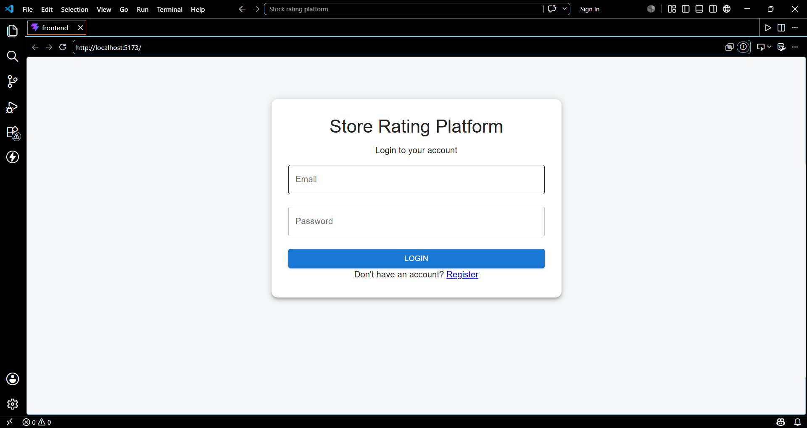
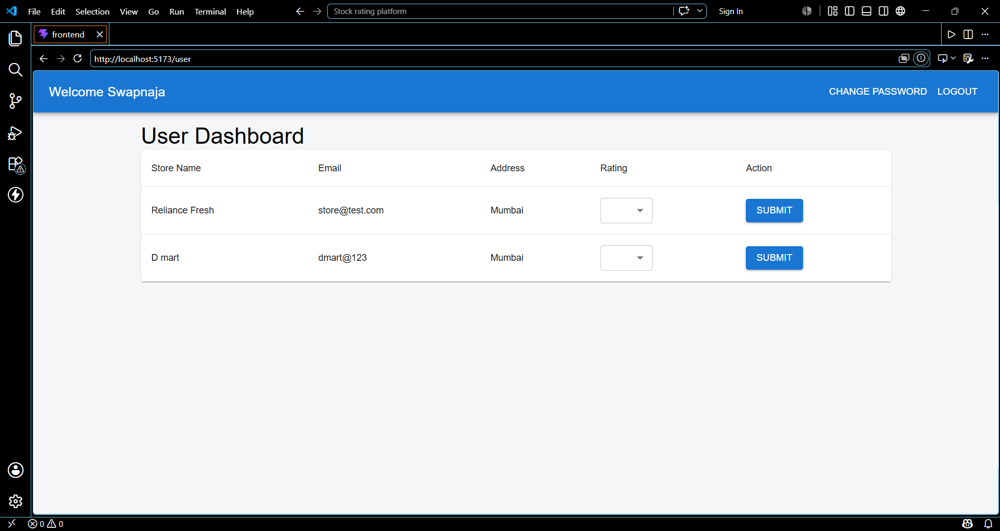
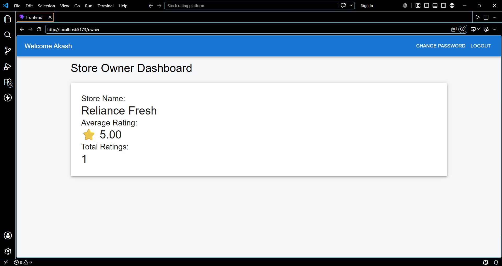

<div align="center">

# 🌟 Store Rating Platform

### 🏪 Rate • Review • Analyze • Manage


### 🚀 Full Stack Web Application

Built with ❤️ by **Akanksha Kulkarni**

</div>

---

# 📖 About The Project

Store Rating Platform is a full-stack web application that allows users to rate stores, store owners to monitor ratings, and administrators to manage stores and users.

The application provides a complete role-based experience with authentication, rating analytics, store management, and user management.

---

# ✨ Features

## 👑 Admin

- Manage Users
- Manage Stores
- Dashboard Analytics
- Search Users
- Search Stores
- Delete Users
- Delete Stores

## 👤 User

- Register Account
- Login
- View Stores
- Submit Ratings
- Update Ratings

## 🏢 Store Owner

- View Average Rating
- View Total Ratings
- Store Analytics Dashboard

---

# 🛠️ Tech Stack

## Frontend

- React.js
- Material UI
- Axios
- React Router DOM

## Backend

- Node.js
- Express.js

## Database

- MySQL

---

# 🗄️ Database Tables

### Users

| Field | Type |
|---------|---------|
| id | INT |
| name | VARCHAR |
| email | VARCHAR |
| password | VARCHAR |
| role | VARCHAR |

### Stores

| Field | Type |
|---------|---------|
| id | INT |
| name | VARCHAR |
| email | VARCHAR |
| address | VARCHAR |
| owner_id | INT |

### Ratings

| Field | Type |
|---------|---------|
| id | INT |
| user_id | INT |
| store_id | INT |
| rating | INT |

---

# 📸 Screenshots


```md






```

---

# ⚙️ Installation

## Clone Repository

```bash
git clone https://github.com/Akanksha9104/Store-Rating-Platform.git
```

## Backend

```bash
cd backend

npm install

npm run dev
```

## Frontend

```bash
cd frontend

npm install

npm run dev
```

---

# 🚀 Future Enhancements

- JWT Authentication
- Password Encryption
- Profile Management
- Rating History
- Cloud Deployment

---

# 📈 Project Highlights

✅ Full Stack Development

✅ REST APIs

✅ CRUD Operations

✅ Role-Based Authentication

✅ MySQL Integration

✅ Responsive UI

---

# 👩‍💻 Author

### Akanksha Kulkarni

🎓 BE Electronics & Telecommunication

💻 Full Stack Developer

🌱 Learning MERN Stack, DSA & Software Development

---

<div align="center">

### ⭐ Star this repository if you like it ⭐

🚀 Happy Coding 🚀

</div>
